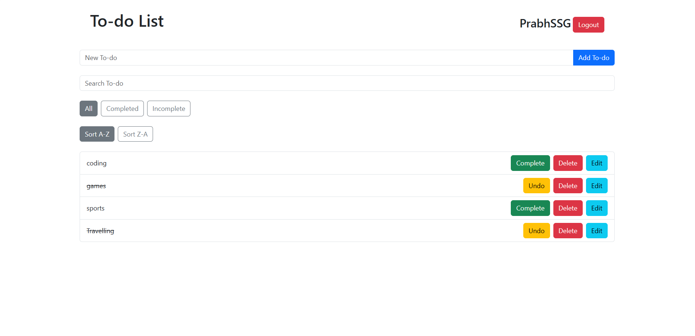

# Todo-List App with Firebase

## Features
- User Authentication (Login with Google)
- Add, Edit, Delete, and Mark To-dos as Complete/Incomplete
- Filter To-dos (All, Completed, Incomplete)
- Persistent Data (Local Storage)
- Responsive Design using Bootstrap
- User-specific To-dos (display only the logged-in user's To-dos)

## Tech Stacks
- React
- Bootstrap
- Firebase

## Screenshots



## Installation

### Prerequisites
- Node.js installed
- Firebase project setup (including Firebase Authentication with Google)

### Steps

1. **Clone the repository:**
   ```bash
   git clone https://github.com/Prabhat-kumar-11/todo-app-firbase.git
   cd todo-list-app

2. **Install dependencies:**
   - npm install
   - npm run dev 

